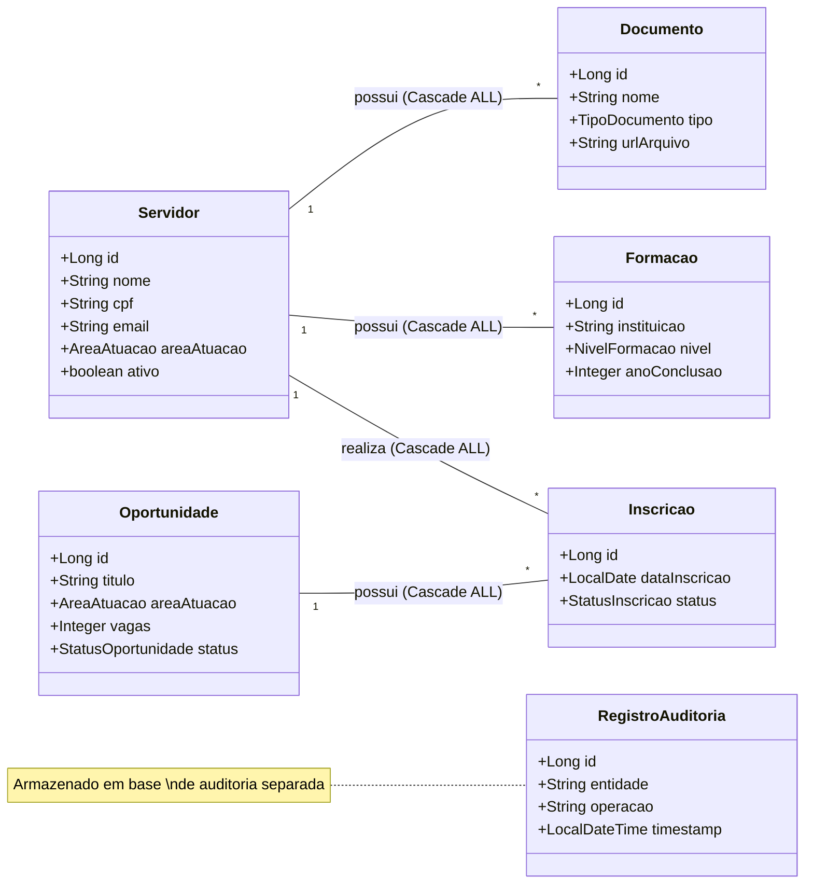

# Talentos — Sistema de Gestão de Talentos Institucionais

> Plataforma de cadastro e relacionamento de servidores, habilidades, capacitações e oportunidades internas de uma instituição pública.

---

## Sobre o Projeto

O **Talentos** é uma API REST desenvolvida em **Spring Boot** para apoiar a gestão estratégica de pessoas em instituições públicas. O sistema centraliza o cadastro de servidores e vincula, de forma estruturada, suas formações acadêmicas, documentos comprobatórios e inscrições em oportunidades internas abertas pela própria instituição.

A solução nasce da necessidade de superar o uso de planilhas e processos manuais dispersos, oferecendo um ponto único e confiável de consulta de talentos disponíveis para iniciativas como:

- Composição de **comissões** e grupos de trabalho
- Indicação para **cargos de confiança** e funções gratificadas
- Participação em **projetos institucionais**
- Inscrição em **cursos de capacitação** e programas de formação internos
- Contribuição em **iniciativas administrativas** e de governança

---

## Justificativa da Solução

### O Problema

Instituições públicas frequentemente enfrentam dificuldades em identificar, de forma ágil e transparente, quais servidores possuem o perfil adequado para uma determinada oportunidade. O processo costuma ser:

- **Descentralizado** — informações fragmentadas em diferentes setores e sistemas legados
- **Manual** — dependente de contatos pessoais e memória organizacional
- **Ineficiente** — sem critérios objetivos de busca por área, formação ou disponibilidade
- **Pouco transparente** — sem registro formal de inscrições e histórico de movimentações

### A Solução Escolhida

Optou-se por uma **API REST com persistência em memória** como ponto de partida, seguindo os princípios de uma arquitetura limpa e evolutiva, com as seguintes justificativas técnicas e estratégicas:

| Decisão | Justificativa |
|---|---|
| **API REST** | Padrão amplamente adotado, agnóstico de frontend; permite integração futura com portais web, sistemas legados ou aplicativos mobile |
| **Spring Boot** | Framework maduro, com ecossistema robusto de validação, injeção de dependências e tratamento de erros |
| **Multi-Database (Supabase)** | Arquitetura com dois bancos PostgreSQL: um para Negócio e outro para Auditoria, garantindo isolamento de dados e segurança |
| **Spring Data JPA** | Abstração de persistência poderosa, gerenciando relacionamentos, transações e mapeamento objeto-relacional (ORM) |
| **Separação Model / DTO** | Garante que dados sensíveis nunca sejam expostos pela API; permite evoluir a representação pública sem quebrar o modelo interno |
| **Enums para categorias** | Categorias como área de atuação, nível de formação e status de inscrição são controladas via Enums Java |
| **Validação na entrada** | Uso de Bean Validation (Jakarta) para garantir integridade dos dados antes do processamento |
| **Baixo acoplamento via interfaces** | Implementações de serviço intercambiáveis (@Qualifier) via ApplicationContext |

---

## Diagrama de Classes e Relacionamentos

O sistema utiliza **Spring Data JPA** para persistência, com relacionamentos formalizados e controle de ciclo de vida via **CascadeType**.



### Detalhamento dos Relacionamentos

| Relacionamento | Tipo | Descrição | Comportamento (Cascade) |
|---|---|---|---|
| **Servidor → Inscricao** | 1:N | Um servidor possui várias inscrições | `ALL` + `orphanRemoval` (excluir servidor limpa inscrições) |
| **Servidor → Documento** | 1:N | Um servidor possui vários documentos | `ALL` + `orphanRemoval` (excluir servidor limpa documentos) |
| **Servidor → Formação** | 1:N | Um servidor possui várias formações | `ALL` + `orphanRemoval` (excluir servidor limpa formações) |
| **Oportunidade → Inscricao** | 1:N | Uma vaga recebe várias inscrições | `ALL` (excluir vaga remove inscrições vinculadas) |
| **Inscrição → Servidor** | N:1 | Inscrição referencia um servidor | — |
| **Inscrição → Oportunidade** | N:1 | Inscrição referencia uma vaga | — |

---

## Tecnologias Utilizadas

| Tecnologia | Versão | Uso |
|---|---|---|
| Java | 17 | Linguagem principal |
| Spring Boot | 4.0.5 | Framework principal |
| Spring Data JPA | — | Persistência e ORM |
| PostgreSQL | 13+ | Bancos de dados (Negócio e Auditoria) |
| Supabase | — | Infraestrutura de Banco de Dados Cloud |
| HikariCP | — | Pool de conexões (Dual Datasource) |
| Lombok | — | Redução de boilerplate |
| Hibernate | 7.x | Engine de persistência |

---

## Arquitetura

```
com.example.talentos
├── config/         DataSourceConfigs (Negócio/Auditoria) · AppConfig
├── controller/     Controllers REST (Servidor, Oportunidade, etc.)
├── dto/            Request DTOs (Bean Validation) e Response DTOs
├── exception/      GlobalExceptionHandler (@RestControllerAdvice)
├── model/
│   ├── enums/      Enums de domínio
│   ├── auditoria/  RegistroAuditoria (Entity)
│   └──             Servidor · Formacao · Oportunidade · Documento · Inscricao
├── repository/
│   ├── negocio/    JpaRepositories para banco primário
│   └── auditoria/  JpaRepositories para banco de auditoria
└── service/
    └── impl/       Implementações com @Transactional e persistência real
```

### Padrões e Boas Práticas Aplicados

- **Separação de camadas** — Model → Repository → Service → Controller, sem dependências invertidas
- **DTO Pattern** — entidades internas nunca trafegam na API
- **Strategy/Decorator com @Qualifier** — duas implementações de serviço intercambiáveis sem alterar controllers
- **Tratamento global de erros** — respostas JSON padronizadas para 400, 404 e 500
- **Regras de negócio centralizadas** — todas as validações semânticas ficam na camada de serviço

---

## Endpoints Disponíveis

Cada recurso expõe o conjunto completo de operações REST:

| Método | Rota | Descrição |
|---|---|---|
| `GET` | `/servidores` | Lista todos os servidores |
| `GET` | `/servidores/{id}` | Busca servidor por ID |
| `GET` | `/servidores/categoria?area=TECNOLOGIA` | Filtra por área de atuação |
| `POST` | `/servidores` | Cadastra novo servidor |
| `PUT` | `/servidores/{id}` | Atualiza dados do servidor |
| `DELETE` | `/servidores/{id}` | Remove servidor |

> O mesmo padrão se aplica a `/formacoes`, `/oportunidades`, `/documentos` e `/inscricoes`.  
> Oportunidades possuem filtro adicional: `GET /oportunidades/area?area=EDUCACAO`.

---

## Como Executar

**Pré-requisito:** Java 17+ e Maven instalados.

```bash
# Clonar o repositório
git clone <url-do-repositório>
cd talentos

# Iniciar a aplicação
./mvnw spring-boot:run
```

A API estará disponível em: **`http://localhost:8080`**

### Troca de Implementação de Serviço

Para ativar o modo de **auditoria** (logging detalhado de todas as operações), altere `application.properties`:

```properties
# Opções: padrao | auditoria
app.servico.implementacao=auditoria
```

---

## Testes

O arquivo `testesTalentos.json` na raiz do projeto contém uma **collection Postman** com 55 requisições cobrindo:

- Cenários de sucesso (201, 200, 204)
- Erros de validação (400 com mapa de campos)
- Violações de regra de negócio (400 com mensagem clara)
- Recursos não encontrados (404)

---

## Próximos Passos (Roadmap)

- [x] Persistência em banco de dados relacional (PostgreSQL via Spring Data JPA)
- [x] Arquitetura Multi-Database (Isolamento de Auditoria)
- [ ] Autenticação e controle de acesso por perfil (Spring Security + JWT)
- [ ] Módulo de habilidades e competências do servidor
- [ ] Notificações automáticas ao servidor sobre status da inscrição
- [ ] Documentação interativa com Swagger / OpenAPI 3
