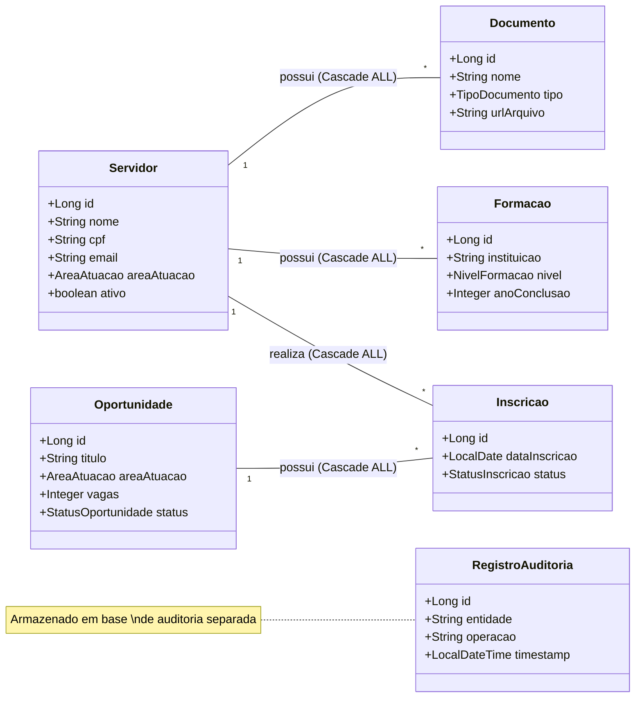

# Talentos — Sistema de Gestão de Talentos Institucionais

> Plataforma de cadastro e relacionamento de servidores, habilidades, capacitações e oportunidades internas de uma instituição pública.

---

## Sobre o Projeto

O **Talentos** é uma API REST desenvolvida em **Spring Boot** para apoiar a gestão estratégica de pessoas em instituições públicas. O sistema centraliza o cadastro de servidores e vincula, de forma estruturada, suas formações acadêmicas, documentos comprobatórios e inscrições em oportunidades internas abertas pela própria instituição.

A solução nasce da necessidade de superar o uso de planilhas e processos manuais dispersos, oferecendo um ponto único e confiável de consulta de talentos disponíveis para iniciativas como:

- Composição de **comissões** e grupos de trabalho
- Indicação para **cargos de confiança** e funções gratificadas
- Participação em **projetos institucionais**
- Inscrição em **cursos de capacitação** e programas de formação internos
- Contribuição em **iniciativas administrativas** e de governança

---

## Justificativa da Solução

### O Problema

Instituições públicas frequentemente enfrentam dificuldades em identificar, de forma ágil e transparente, quais servidores possuem o perfil adequado para uma determinada oportunidade. O processo costuma ser:

- **Descentralizado** — informações fragmentadas em diferentes setores e sistemas legados
- **Manual** — dependente de contatos pessoais e memória organizacional
- **Ineficiente** — sem critérios objetivos de busca por área, formação ou disponibilidade
- **Pouco transparente** — sem registro formal de inscrições e histórico de movimentações

### A Solução Escolhida

Optou-se por uma **API REST com persistência em memória** como ponto de partida, seguindo os princípios de uma arquitetura limpa e evolutiva, com as seguintes justificativas técnicas e estratégicas:

| Decisão | Justificativa |
|---|---|
| **API REST** | Padrão amplamente adotado, agnóstico de frontend; permite integração futura com portais web, sistemas legados ou aplicativos mobile |
| **Spring Boot** | Framework maduro, com ecossistema robusto de validação, injeção de dependências e tratamento de erros |
| **Multi-Database (Supabase)** | Arquitetura com dois bancos PostgreSQL: um para Negócio e outro para Auditoria, garantindo isolamento de dados e segurança |
| **Spring Data JPA** | Abstração de persistência poderosa, gerenciando relacionamentos, transações e mapeamento objeto-relacional (ORM) |
| **Separação Model / DTO** | Garante que dados sensíveis nunca sejam expostos pela API; permite evoluir a representação pública sem quebrar o modelo interno |
| **Enums para categorias** | Categorias como área de atuação, nível de formação e status de inscrição são controladas via Enums Java |
| **Validação na entrada** | Uso de Bean Validation (Jakarta) para garantir integridade dos dados antes do processamento |
| **Baixo acoplamento via interfaces** | Implementações de serviço intercambiáveis (@Qualifier) via ApplicationContext |

---

## Diagrama de Classes e Relacionamentos

O sistema utiliza **Spring Data JPA** para persistência, com relacionamentos formalizados e controle de ciclo de vida via **CascadeType**.



### Detalhamento dos Relacionamentos

| Relacionamento | Tipo | Descrição | Comportamento (Cascade) |
|---|---|---|---|
| **Servidor → Inscricao** | 1:N | Um servidor possui várias inscrições | `ALL` + `orphanRemoval` (excluir servidor limpa inscrições) |
| **Servidor → Documento** | 1:N | Um servidor possui vários documentos | `ALL` + `orphanRemoval` (excluir servidor limpa documentos) |
| **Servidor → Formação** | 1:N | Um servidor possui várias formações | `ALL` + `orphanRemoval` (excluir servidor limpa formações) |
| **Oportunidade → Inscricao** | 1:N | Uma vaga recebe várias inscrições | `ALL` (excluir vaga remove inscrições vinculadas) |
| **Inscrição → Servidor** | N:1 | Inscrição referencia um servidor | — |
| **Inscrição → Oportunidade** | N:1 | Inscrição referencia uma vaga | — |

---

## Tecnologias Utilizadas

| Tecnologia | Versão | Uso |
|---|---|---|
| Java | 17 | Linguagem principal |
| Spring Boot | 4.0.5 | Framework principal |
| Spring Security | — | Autenticação HTTP Basic + autorização RBAC via `@PreAuthorize` |
| Spring Data JPA | — | Persistência e ORM |
| PostgreSQL | 13+ | Bancos de dados (Negócio e Auditoria) |
| Supabase | — | Infraestrutura de Banco de Dados Cloud |
| HikariCP | — | Pool de conexões (Dual Datasource) |
| Lombok | — | Redução de boilerplate |
| Hibernate | 7.x | Engine de persistência |

---

## Arquitetura

```
com.example.talentos
├── config/         SecurityConfig · DataSourceConfigs (Negócio/Auditoria) · AppConfig
├── controller/     TalentosController · ServidorController · OportunidadeController ...
├── dto/            Request DTOs (Bean Validation) · Response DTOs · TalentosInfoDTO · TalentosRecursoDTO
├── exception/      GlobalExceptionHandler (400, 401, 403, 404, 500)
├── model/
│   ├── enums/      Enums de domínio
│   ├── auditoria/  RegistroAuditoria (Entity)
│   └──             Servidor · Formacao · Oportunidade · Documento · Inscricao
├── repository/
│   ├── negocio/    JpaRepositories para banco primário
│   └── auditoria/  JpaRepositories para banco de auditoria
└── service/
    └── impl/       Implementações com @Transactional e persistência real
```

### Padrões e Boas Práticas Aplicados

- **Separação de camadas** — Model → Repository → Service → Controller, sem dependências invertidas
- **DTO Pattern** — entidades internas nunca trafegam na API; dados sensíveis são mascarados
- **RBAC declarativo** — `@PreAuthorize` em cada método controla acesso por papel
- **Strategy com @Qualifier** — implementações de serviço intercambiáveis sem alterar controllers
- **Tratamento global de erros** — respostas JSON padronizadas para 400, 401, 403, 404 e 500
- **Regras de negócio centralizadas** — validações semânticas ficam exclusivamente na camada de serviço

---

## Camada de Segurança

A aplicação utiliza **Spring Security** com autenticação **HTTP Basic** e autorização baseada em papéis (RBAC). Cada método dos controllers é protegido com `@EnableMethodSecurity` + `@PreAuthorize`.

### Papéis e Usuários de Teste

| Usuário | Senha | Role | Permissões |
|---|---|---|---|
| `admin` | `admin123` | `ROLE_ADMIN` | Acesso total — todos os endpoints |
| `gestor` | `gestor123` | `ROLE_GESTOR` | Gerência de servidores e oportunidades; consulta de inscrições/docs/formações |
| `usuario` | `usuario123` | `ROLE_USUARIO` | Consulta oportunidades; cadastra inscrições, documentos e formações próprios |

> **Como autenticar:** `curl -u admin:admin123 http://localhost:8080/servidores`

### Matriz de Permissões

Legenda: ✅ Permitido · 🚫 403 Forbidden · 🔒 401 Unauthorized

#### `/talentos` — Endpoints de segurança

| Endpoint | Método | ADMIN | GESTOR | USUARIO | Sem Auth |
|---|---|:---:|:---:|:---:|:---:|
| `/talentos/info` | `GET` | ✅ | ✅ | ✅ | ✅ |
| `/talentos/recursos` | `GET` | ✅ | ✅ | ✅ | 🔒 |
| `/talentos/recursos/{id}` | `GET` | 🚫 | ✅ | ✅ | 🔒 |
| `/talentos/recursos/{id}` | `DELETE` | ✅ | 🚫 | 🚫 | 🔒 |

#### `/servidores`

| Endpoint | Método | ADMIN | GESTOR | USUARIO | Sem Auth |
|---|---|:---:|:---:|:---:|:---:|
| `/servidores` | `GET` | ✅ | ✅ | 🚫 | 🔒 |
| `/servidores/{id}` | `GET` | ✅ | ✅ | 🚫 | 🔒 |
| `/servidores/categoria` | `GET` | ✅ | ✅ | 🚫 | 🔒 |
| `/servidores` | `POST` | ✅ | ✅ | 🚫 | 🔒 |
| `/servidores/{id}` | `PUT` | ✅ | ✅ | 🚫 | 🔒 |
| `/servidores/{id}` | `DELETE` | ✅ | 🚫 | 🚫 | 🔒 |

#### `/oportunidades`

| Endpoint | Método | ADMIN | GESTOR | USUARIO | Sem Auth |
|---|---|:---:|:---:|:---:|:---:|
| `/oportunidades` | `GET` | ✅ | ✅ | ✅ | 🔒 |
| `/oportunidades/{id}` | `GET` | ✅ | ✅ | ✅ | 🔒 |
| `/oportunidades/categoria` | `GET` | ✅ | ✅ | ✅ | 🔒 |
| `/oportunidades/area` | `GET` | ✅ | ✅ | ✅ | 🔒 |
| `/oportunidades` | `POST` | ✅ | ✅ | 🚫 | 🔒 |
| `/oportunidades/{id}` | `PUT` | ✅ | ✅ | 🚫 | 🔒 |
| `/oportunidades/{id}` | `DELETE` | ✅ | 🚫 | 🚫 | 🔒 |

#### `/inscricoes` · `/documentos` · `/formacoes`

| Endpoint | Método | ADMIN | GESTOR | USUARIO | Sem Auth |
|---|---|:---:|:---:|:---:|:---:|
| `/{recurso}` | `GET` | ✅ | ✅ | 🚫 | 🔒 |
| `/{recurso}/{id}` | `GET` | ✅ | ✅ | 🚫 | 🔒 |
| `/{recurso}/categoria` | `GET` | ✅ | ✅ | 🚫 | 🔒 |
| `/inscricoes` | `POST` | ✅ | 🚫 | ✅ | 🔒 |
| `/documentos` | `POST` | ✅ | 🚫 | ✅ | 🔒 |
| `/formacoes` | `POST` | ✅ | 🚫 | ✅ | 🔒 |
| `/documentos/{id}` | `PUT` | ✅ | 🚫 | ✅ | 🔒 |
| `/formacoes/{id}` | `PUT` | ✅ | 🚫 | ✅ | 🔒 |
| `/inscricoes/{id}` | `PUT` | ✅ | ✅ | 🚫 | 🔒 |
| `/{recurso}/{id}` | `DELETE` | ✅ | 🚫 | 🚫 | 🔒 |

---

## Desacoplamento: Entidade vs DTO

O padrão DTO isola a entidade de domínio da API. A entidade carrega mapeamentos JPA, dados sensíveis e coleções — nada disso chega ao cliente.

### Exemplo: `Servidor`

**1. Entidade (banco de dados — nunca exposta diretamente)**

```json
{
  "id": 1,
  "nome": "João Silva",
  "cpf": "12345678901",
  "email": "joao.silva@gov.br",
  "cargo": "Analista de TI",
  "areaAtuacao": "TECNOLOGIA",
  "ativo": true,
  "inscricoes": [ ... ],
  "documentos": [ ... ],
  "formacoes": [ ... ]
}
```

**2. Request DTO — corpo enviado pelo cliente (`POST /servidores`)**

```json
{
  "nome": "João Silva",
  "cpf": "12345678901",
  "email": "joao.silva@gov.br",
  "cargo": "Analista de TI",
  "areaAtuacao": "TECNOLOGIA",
  "ativo": true
}
```

> `id` não é enviado (gerado pelo banco). Campos obrigatórios validados com `@NotBlank`, `@NotNull`, `@Email`.

**3. Response DTO — resposta da API (`201 Created`)**

```json
{
  "id": 1,
  "nome": "João Silva",
  "cpfMascarado": "***.456.***.**-**",
  "email": "joao.silva@gov.br",
  "cargo": "Analista de TI",
  "areaAtuacao": "TECNOLOGIA",
  "ativo": true
}
```

> CPF mascarado (dado sensível protegido). Coleções JPA (`inscricoes`, `documentos`, `formacoes`) omitidas.

**4. Erro de validação (`400 Bad Request`)**

```json
{
  "timestamp": "2026-05-04T22:00:00",
  "status": 400,
  "erro": "Bad Request",
  "mensagem": "Validação falhou. Verifique os campos.",
  "campos": {
    "email": "E-mail inválido",
    "nome": "Nome é obrigatório"
  }
}
```

**5. Acesso negado (`403 Forbidden`)**

```json
{
  "timestamp": "2026-05-04T22:00:00",
  "status": 403,
  "erro": "Forbidden",
  "mensagem": "Acesso negado: você não tem permissão para executar esta operação."
}
```

---

## Como Executar

**Pré-requisito:** Java 17+ e Maven instalados.

```bash
# Clonar o repositório
git clone <url-do-repositório>
cd talentos

# Iniciar a aplicação
./mvnw spring-boot:run
```

A API estará disponível em: **`http://localhost:8080`**

### Troca de Implementação de Serviço

Para ativar o modo de **auditoria** (logging detalhado de todas as operações), altere `application.properties`:

```properties
# Opções: padrao | auditoria
app.servico.implementacao=auditoria
```

---

## Testes

O arquivo `testesTalentos.json` na raiz do projeto contém uma **collection Postman** com 55 requisições cobrindo:

- Cenários de sucesso (201, 200, 204)
- Erros de validação (400 com mapa de campos)
- Violações de regra de negócio (400 com mensagem clara)
- Recursos não encontrados (404)

